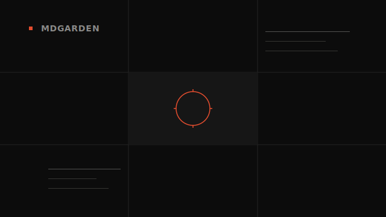

# mdgarden

`mdgarden` is a lightweight local markdown browser for a folder of notes or docs. It scans `.md` and `.markdown` files, opens them in a browser UI, follows relative links and images, supports split panes, and refreshes when files change.



## Install

Requires Node.js 20+.

```bash
npm install
npm run build
npm link
```

## Usage

Start it in the current directory:

```bash
mdgarden show
```

Start it for a specific folder:

```bash
mdgarden show ./docs
```

Command:

```text
mdgarden show [root] [--port <number>] [--no-open]
```

- `root` defaults to the current directory.
- `--port` defaults to `3210`. If that port is busy, `mdgarden` uses the next available one.
- `--no-open` starts the server without opening your browser.
